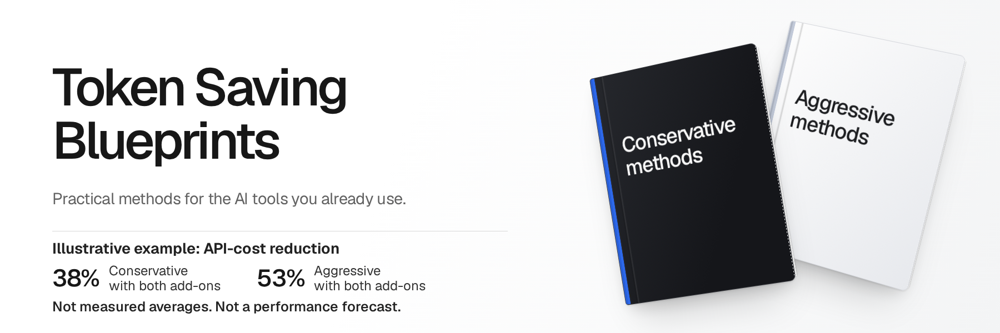

<h1 align="center">Token Saving Blueprints</h1>

<p align="center">
  <a href="#illustrative-api-cost-scenario"></a>
</p>

<p align="center"><strong>Illustration only:</strong> the banner figures are calculated API-cost examples with both add-ons, not measured averages or predictions.</p>

<p align="center">
  <a href="LICENSE"></a>
  <a href="#choose-the-mode-by-the-work"></a>
  <a href="VALIDATION.md"></a>
</p>
<p align="center">
  <a href="docs/delegation.md"></a>
  <a href="docs/addons/omniroute.md"></a>
</p>

**Practical Conservative and Aggressive methods for the AI tools you already use.**

For developers, executives and teams who want less wasted AI spend without replacing their working system. This is a set of blueprints, configuration recipes and verification checklists. It is **not** a new agent, proxy service or subscription broker.

[Platform compatibility](docs/platform-coverage.md) · [Start here](START-HERE.md) · [Conservative](docs/modes/conservative.md) · [Aggressive](docs/modes/aggressive.md) · [Choose your harness](docs/harnesses/index.md) · [Evidence](docs/evidence.md)

## What you get

- A route for your actual harness, login method and provider, not a generic API-key assumption.
- Two modes that preserve requested work, approvals and the selected main model unless you separately choose a cost tradeoff.
- Methods to avoid repeated model calls before trying to compress their contents.
- Coding, documents, research, recurring operations and team handoff playbooks.
- Native features first, optional components only where they add value.
- A baseline, one-change trial and rollback for every meaningful change.
- Clear evidence limits instead of a universal savings percentage.

## Choose the mode by the work

| | Conservative | Aggressive |
|---|---|---|
| Purpose | Remove avoidable work and unnecessary context | Reduce eligible context further, accepting a stated recovery/quality tradeoff |
| Keep | Scope, model, effort, native login, permissions and required checks | The same protected requirements |
| Use | Exact retrieval, complete calculations, native edits, valid reuse, compact task views | Those methods plus supported selective views and checkpoint summaries |
| Avoid | New generic lossy history rewrites, silent sampling or model demotion | Blind deletion, unsupported history edits, lost qualifiers, weakened tests |
| Default | Start here | Use for an eligible task, not every session |

Both modes can leave a short or information-dense task unchanged. A smaller incomplete answer is not a saving.

## Illustrative API-cost scenario

**Calculated examples, not observed averages, performance forecasts or token-saving guarantees.** The assumptions below were chosen to explain how the options combine. They were not derived as typical results from a benchmark of this repository.

| Mode | OmniRoute compression | Cheaper-model delegation | Modelled API-cost reduction |
|---|:---:|:---:|---:|
| Conservative | Off | Off | ~20% |
| Conservative | On | Off | ~24% |
| Conservative | Off | On | ~35% |
| Conservative | On | On | ~38% |
| Aggressive | Off | Off | ~35% |
| Aggressive | On | Off | ~42% |
| Aggressive | Off | On | ~47% |
| Aggressive | On | On | ~53% |

The highlighted **38% Conservative** and **53% Aggressive** examples include both add-ons. They are not independent gains to add together. Delegation is task-aware guidance for suitable small jobs, not a fixed routing quota or a universal automatic router supplied by this repository.

<details>
<summary><strong>Assumptions and reproducible arithmetic</strong></summary>

- Baseline: **$10,000 of variable API charges** for comparable work, not a fixed subscription fee.
- Mode alone: assume **20%** cost reduction for Conservative or **35%** for Aggressive. These are chosen inputs, not measured mode averages.
- Delegation: assume **30% of the remaining model spend** can move to workers costing **20% as much per unit at unchanged usage volume**. Add overhead equal to **5% of the remaining spend** for coordination, verification and repair. The assumed remaining-cost multiplier is `0.70 + 0.30 × 0.20 + 0.05 = 0.81`.
- OmniRoute: assume another **5% Conservative / 10% Aggressive net reduction in remaining cost**, only from nonoverlapping opportunities after the preceding methods. These increments are not evidence of OmniRoute's actual performance.
- The same complete accepted result and comparable billing/cache conditions are assumed, not demonstrated. Extra recovery, cache losses, changed worker token volume or lost quality can erase the apparent saving.

`final cost = baseline × (1 − base reduction) × optional delegation multiplier × optional OmniRoute multiplier`

For both add-ons, that produces **$6,156** for Conservative and **$4,738.50** for Aggressive. The table rounds the reductions to whole percentages. Inputs and outputs are in [the scenario data](examples/api-cost-scenario.json); the repository checker recomputes every combination using decimal arithmetic.

</details>

**Do not apply these percentages to token counts, subscription quotas or fixed monthly fees.** OmniRoute's OAuth support does not make those meters equivalent. If a method duplicates native optimization or produces extra work, the actual gain can be zero or negative. See [measurement](docs/measurement.md) and [evidence](docs/evidence.md).

## The operating loop

**Identify the route → record the baseline → avoid unnecessary calls → prepare the right evidence → execute the full task → verify → keep or revert the change.**

The point is not to make every prompt tiny. It is to stop paying repeatedly for the same discovery, bulk data movement and unnecessary generation, while retaining the model for judgment.

For coding, use existing functions and native platform capabilities, focused code navigation, precise patches and complete project checks. An attributed Ponytail-inspired policy is included, with no permission to ship less than requested or cut required tests.

For business work, use complete source manifests and code for pagination, calculations, joins and report production. If every passage needs semantic review, every relevant passage still needs to be reviewed. Top-k search is not “read everything.”

For recurring work, use validated recipes and change detection where appropriate. A deterministic no-change check can avoid a model call, but a scheduled review, failed fetch or material ambiguity must not be suppressed.

## Subscriptions, APIs and providers are different routes

A subscription is not an API key. A compatible endpoint is not proof that it preserves your tools, context state, billing or provider permissions.

- **Native subscription/OAuth:** retain the supported native route by default. Provider-specific OAuth integrations and CLI-owned bridges are separate optional paths, not generic interchangeable tokens. Check technical support, provider terms, account entitlement and actual billing independently.
- **Direct API:** keep the selected model and account. Native caching, task preparation and eligible request changes can affect the bill; measure the complete task.
- **Cloud or managed provider:** retain the organization’s endpoint, identity and policy. Confirm which features the actual route exposes.
- **Mixed setup:** identify which route each job used. Switching between subscriptions and APIs requires an approved, equivalent path and an explicit spending decision.

Read [authentication and billing](docs/auth-and-billing.md) before copying a configuration.

## A useful edge, not a pile of tools

The repository connects five decisions that are often documented separately:

1. **Route passport:** what the harness, authentication and provider combination actually allows.
2. **Coverage contract:** exact lookup, complete computation, complete semantic review or exploration.
3. **One owner per surface:** do not let several plugins and proxies independently rewrite the same context.
4. **Change receipt:** what changed, what stayed protected, how to verify it and how to undo it.
5. **Outcome accounting:** include retries, restoration and failure, not just the smaller intermediate payload.

These are operating methods and templates, not claims that a new runtime enforces them automatically. See [system map](docs/system-map.md).

## Optional delegation and OmniRoute

Use [native or headless delegation](docs/delegation.md) when a bounded worker helps. API models do not each need a separate app window, but tool-capable workers still need their actual runtime and permissions. The main agent remains accountable.

[OmniRoute](docs/addons/omniroute.md) is an optional API-facing gateway with API-key, OAuth and CLI-owned upstream paths. Either blueprint mode can use an independently approved compatible route. Its [compression inventory](docs/addons/omniroute-compression.md) describes source-inspected controls, not authenticated account tests. This blueprint does not supply an all-features preset or grant permission to rebroker other people's subscriptions. The selected route, fallback, cache and data gates must pass first; otherwise retain the existing supported route.

[Cheaper/free worker models](docs/addons/free-provider-lanes.md) are separately consented cost choices. They can change dollars without reducing tokens, and no extra 20–30% is promised. Do not enable every layer or pool human accounts.

## Use it with your agent

Give your assistant this repository and [USE-WITH-YOUR-AGENT.md](USE-WITH-YOUR-AGENT.md). It should identify the actual route, propose a small reversible change, ask before changing your setup, and verify the result. It must not overwrite existing instructions, change your model, disable checks or install everything in the component catalogue.

Prefer manual setup? Follow [START-HERE.md](START-HERE.md), then your [harness guide](docs/harnesses/index.md).

## Practical playbooks

- [Coding and review](docs/playbooks/coding.md)
- [Documents, research and financial data](docs/playbooks/documents-and-data.md)
- [Recurring operations](docs/playbooks/recurring-work.md)
- [Teams and cross-harness handoffs](docs/playbooks/teams.md)
- [Failure, recovery and edge cases](docs/edge-cases.md)

## What the numbers mean

This repository does not claim a measured average saving across all harnesses or subscriptions. Published compressor results often measure selected input, command output, estimated cost or one benchmark, not the whole job.

The research contains credible opportunities, including task-aware code selection and selective trajectory reduction. It also contains regressions, cache penalties and weak baselines. Read [evidence](docs/evidence.md), [measurement](docs/measurement.md) and [component selection](docs/component-selection.md) before using a headline number.

For a fixed subscription, fewer tokens do not automatically lower the monthly fee. They may provide more useful capacity or reduce additional usage. API savings, quota headroom and subscription right-sizing must be reported separately.

## Scope and validation

The guides prioritize major official tools and established ecosystems. Explicitly requested ambiguous names receive identity guidance, not invented installation recipes. A market scan has a disclosed scope; it is not a claim to have inspected every Internet project.

The [factual revalidation note](docs/revalidation.md) records the coverage, corrections and unresolved boundaries.

[VALIDATION.md](VALIDATION.md) separates documentation checks, source inspection, local fixture tests and native account trials. A passing repository checker does not certify every provider login or prove unchanged model quality.

Maintainers can run the dependency-free repository checks with Python 3.10 or later:

```bash
python3 scripts/validate.py
python3 -m unittest discover -s tests -v
```

On Windows, use `py -3` instead of `python3` when that is how Python is installed.

## Explore or maintain

[Market landscape](docs/market-landscape.md) · [Install and rollback](docs/install-and-rollback.md) · [Privacy](docs/privacy.md) · [Sources and claims policy](docs/claims-policy.md) · [Contributing](CONTRIBUTING.md)

Original material is MIT licensed. Referenced projects retain their own licenses, provider terms and trademarks. See [THIRD_PARTY_NOTICES.md](THIRD_PARTY_NOTICES.md).
